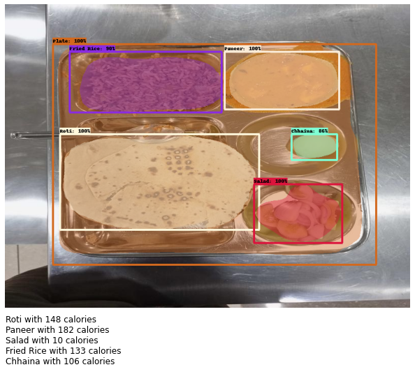

# Calorie Estimation System

## Overview

Most of the world’s population live in countries where overweight and obesity kills more people than underweight. If people could estimate their calorie intake using the images of their food, they can easily decide on the amount of calories they want to consume. 

This work proposes an image-based Calorie estimator built using deep learning that can be a convenient app to keep track of what an individual’s diet plan contains.

## Dataset
This dataset consist of 88 labeled food images. Images in this dataset are of food served in college mess. These images were captured using smartphone's camera and converted into 600*800 size. Labelme tool was used for labeling these images for segmentation task. Dataset is divided into train and test sets in a ratio of 90:10. 16 different types of food is present in images of this dataset.

You can find this dataset on <a href="https://www.kaggle.com/datasets/tapendrakumar09/indian-mess-food-dataset">Kaggle</a>.

## TechStack/framework used

- [Pillow](https://pillow.readthedocs.io/en/stable/)
- [Tensorflow/Keras](https://www.tensorflow.org/)
- [Tensorflow Object Detection API](https://github.com/tensorflow/models/tree/master/research/object_detection)

## Proposed System
To estimate calories of the food present in the image, we have to identify the type of food and area in the image where it is present. This can be thought of as an image segmentation task. I've used Tensorflow Object Detection API to train Mask-RCNN model for this task.

We need a method to measure the size of the meal or estimate its calorie content in actual settings because the same object can be shot from different depths to yield differing picture sizes. In order to determine the real size of the food present in that particular image, I've used a referencing strategy that compares the size of the food-objects to that of the previously known object. I used a plate as a reference item to estimate the amount of food found in photos.

## Results

    

***
Output of Calorie Estimation System
***
